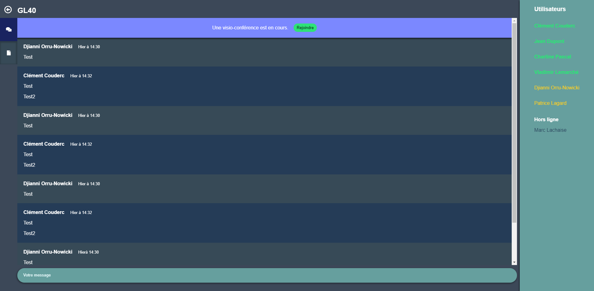

# Projet GL40 P20
L'objectif de ce projet est de présenter une interface d'application 
## Captures d'écran
Ecran de connexion :

Menu principal :

Page de chat d'un cours : 

Page d'une visio-conférence en cours : 
